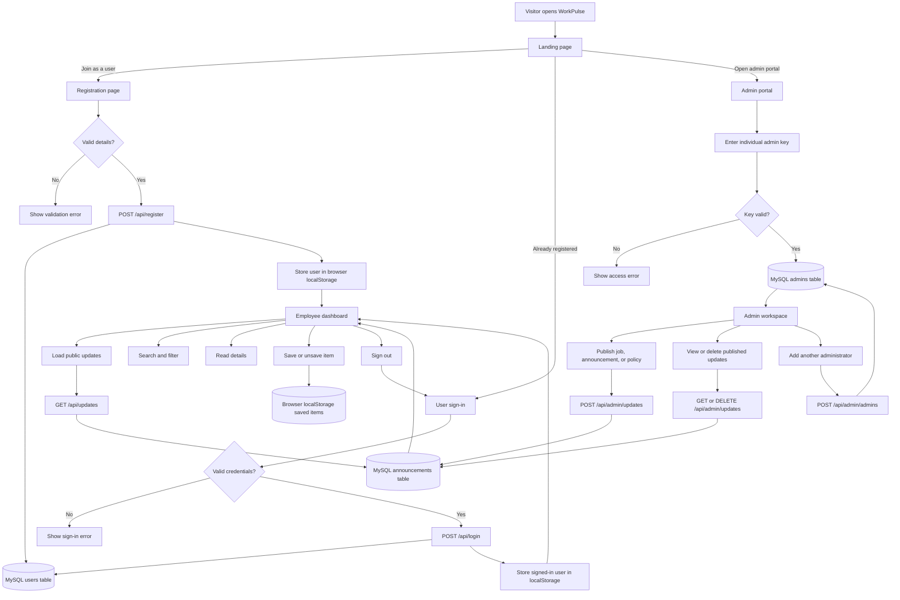

# WorkPulse

WorkPulse is an employee opportunity and information hub. Users can discover hiring opportunities, employee announcements, and policy updates in one dashboard. Administrators can publish and manage that content from a separate portal.

## Project flowchart



### Flow summary

1. Visitors choose whether they are a user or an administrator from the landing page.
2. Users register or sign in, then reach the personalized employee dashboard.
3. The dashboard loads published content from the announcements table and stores saved items in browser storage.
4. Administrators authenticate with their own key and publish jobs, announcements, or policies.
5. Published admin content becomes available to employees through the public updates API.
6. Authenticated administrators can add more administrators with separate keys.

## Features

### Landing page

The root URL provides two workspace choices:

- **Join as a user**: opens the user registration page.
- **Open admin portal**: opens the administrator publishing portal.

### User experience

- User registration with name, email, password, and password confirmation.
- User sign-in with email and password.
- Personalized dashboard greeting using the user's name.
- Time-based greeting: morning, afternoon, or evening.
- Automatic current date display.
- Dashboard feed for announcements, jobs, and policy updates.
- Search updates by title, details, category, or metadata.
- Filter updates by all, announcements, jobs, or policies.
- Open update details in a side drawer.
- Save and unsave updates with the star button.
- Saved items list in the dashboard sidebar.
- Sign out from the account control.
- Weekly digest button with confirmation feedback.

Saved items and the signed-in user profile are stored in browser `localStorage` for the current browser.

### Admin experience

The admin portal is available at `/admin.html`.

Administrators can:

- Publish hiring opportunities.
- Publish employee announcements.
- Publish policy updates.
- Add department, location, and deadline/effective-date information.
- View published updates.
- Delete published updates.
- Add additional administrators.
- View the administrator roster.

Each administrator has a separate name, email address, and admin key. Admin keys are stored in the database as SHA-256 hashes and are never displayed in the administrator roster.

## Routes

| Route | Purpose |
| --- | --- |
| `/` | Landing page with user and admin choices |
| `/index.html` | Employee dashboard |
| `/register.html` | User registration |
| `/login.html` | User sign-in |
| `/admin.html` | Admin publishing and administrator management |

## Requirements

- Node.js
- MySQL Server
- A MySQL database user with permission to create the `app_db` database and tables

## Setup

Install dependencies:

```powershell
npm install
```

Start MySQL, then start the application from the project directory:

```powershell
node server.js
```

The application runs at:

```text
http://localhost:3000/
```

Only one terminal is required for the Node.js application. MySQL runs separately as a Windows service or database process.

## Local admin access

On first startup, the application creates the first administrator automatically if the `admins` table is empty.

Default local admin key:

```text
local-workpulse-admin
```

Use it in the **Admin key** field on `/admin.html`.

For a custom key, set `ADMIN_KEY` before starting the server:

```powershell
$env:ADMIN_KEY = "replace-with-a-strong-local-key"
node server.js
```

The existing local bootstrap administrator is created with:

- Name: `Primary Admin`
- Email: `admin@workpulse.local`

After signing in with an admin key, use the **Administrators** section to add more admins. New admin keys must contain at least 8 characters and must be unique.

## API

### User endpoints

- `POST /api/register` creates a user.
- `POST /api/login` signs in a user.
- `POST /api/google-auth` supports the existing Google authentication integration.

### Public update endpoint

- `GET /api/updates` returns published updates for the employee dashboard.

### Admin endpoints

Admin endpoints require the following request header:

```text
x-admin-key: your-admin-key
```

Available endpoints:

- `GET /api/admin/profile` returns the authenticated admin profile.
- `GET /api/admin/updates` returns published updates.
- `POST /api/admin/updates` publishes an update.
- `DELETE /api/admin/updates/:id` removes an update.
- `GET /api/admin/admins` returns the administrator roster.
- `POST /api/admin/admins` creates another administrator.

Example publish request:

```json
{
  "type": "job",
  "title": "Senior Product Analyst",
  "body": "Work with the Growth team on product decisions.",
  "department": "Product",
  "location": "Bengaluru / Hybrid",
  "deadline": "Apply by 08 Oct 2026"
}
```

Valid update types are:

- `job`
- `announcement`
- `policy`

## Database

The server creates the `app_db` database and these tables when it starts:

- `users`: registered employee accounts.
- `announcements`: published jobs, announcements, and policies.
- `admins`: administrator identities and hashed admin keys.

The current local MySQL connection is configured in `server.js`. Before production use, move database credentials and secrets to environment variables, set a strong `PASSWORD_PEPPER`, use HTTPS, and replace the simple admin-key header with a full authenticated admin session.

## Project files

- `server.js`: Express server, MySQL setup, authentication, and APIs.
- `landing.html` / `landing.css`: role-selection landing page.
- `index.html` / `style.css` / `script.js`: employee dashboard.
- `register.html` / `register.js`: user registration.
- `login.html` / `login.js`: user sign-in.
- `admin.html` / `admin.css` / `admin.js`: admin portal.
- `package.json`: Node.js dependencies and project metadata.

## Troubleshooting

### Admin publish returns an access error

Use the correct admin key. The default local key is `local-workpulse-admin`. If an old key is cached in the browser session, refresh the page and enter the current key again.

### Database startup fails

Confirm that MySQL is running, the credentials in `server.js` are correct, and the MySQL user can create the `app_db` database.

### Dashboard content is not updating

Refresh the dashboard after publishing. The dashboard loads published updates from `GET /api/updates` when the page opens.
