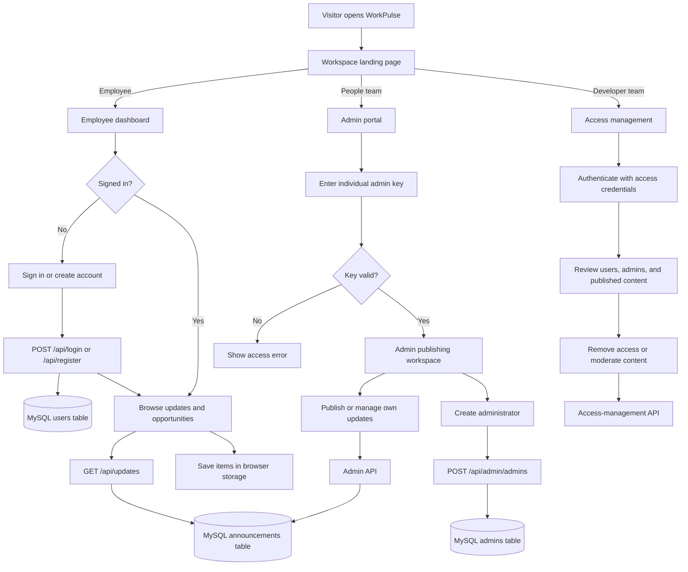

# WorkPulse

WorkPulse is an internal workspace for employee accounts, company updates, and administrator tools. Employees can register or sign in to view opportunities, announcements, and policy updates. People-team admins publish updates, and developer admins manage access and moderation.

## Project flowchart



### Flow summary

1. Employees open the dashboard. If they are not signed in, they are sent to the sign-in page, which also links to registration.
2. Employee accounts and published updates are stored in MySQL; the dashboard saves the signed-in profile and saved items in browser storage.
3. People-team admins use individual admin keys to publish and manage updates.
4. Developer admins use the separate access-management page to review and remove users, admins, or published content.
5. The access-management page runs on its own local port and uses the main app's API.

## Features

### Landing page

The root URL provides three workspace choices:

- **User dashboard**: shows all published hiring opportunities, announcements, and policies.
- **Admin portal**: allows people-team admins to publish jobs, announcements, and policies.
- **Administrator controls**: developer-team-only access for removing users, admins, and misleading content.

### User experience

- User registration with name, email, password, and password confirmation.
- User sign-in with email and password.
- The dashboard redirects unsigned visitors to sign-in; the sign-in page links to account creation.
- Passwords are salted and hashed by the server before they are stored.
- Personalized dashboard greeting using the user's name.
- Time-based greeting: morning, afternoon, or evening.
- Automatic current date display.
- Dashboard feed for announcements, jobs, and policy updates.
- Search updates by title, details, category, or metadata.
- Filter updates by all, announcements, jobs, or policies.
- Open update details in a side drawer.
- Save and unsave updates with the star button.
- Saved items list in the dashboard sidebar.
- Sign out from the account control.
- The weekly digest control currently displays confirmation feedback; no email delivery service is connected.

Saved items and the signed-in user profile are stored in browser `localStorage` for the current browser.

### Admin experience

The admin portal is available at `/admin.html`.

The portal first asks for the administrator's individual key. After successful authentication, the admin sees only announcements published by that admin. The signed-in admin can publish, review, and delete their own updates, and can log out from the portal header.

Use **Manage administrators** to create another admin account. After creation, the setup page provides a link to sign in to the publishing portal as that administrator.

The access-management page is served separately at `http://localhost:3001/access-management.html`. Configure its administrator ID and password through the `ACCESS_ADMIN_ID` and `ACCESS_ADMIN_PASSWORD` environment variables before starting the main server. Do not store real credentials in source code or commit them to GitHub.

Administrators can:

- Publish hiring opportunities.
- Publish employee announcements.
- Publish policy updates.
- Add department, location, and deadline/effective-date information.
- View their own published updates.
- Delete their own published updates.
- Add additional administrators.
- View the administrator roster.
- Remove another administrator's access.
- Remove registered users.
- Review all published content for moderation.
- Remove misleading jobs, announcements, or policy updates.

Each administrator has a separate name, email address, and admin key. Admin keys are stored directly in the database and must be unique. Keys are never displayed in the administrator roster.

## Routes

| Route | Purpose |
| --- | --- |
| `/` | Landing page with employee, admin, and developer choices |
| `/index.html` | Employee dashboard |
| `/register.html` | User registration |
| `/login.html` | User sign-in |
| `/admin.html` | Admin publishing and administrator management |
| `/administrators.html` | Administrator creation and roster page |
| `http://localhost:3001/access-management.html` | Separate page for managing access and moderating content |

## Requirements

- Node.js
- MySQL Server
- A MySQL database user with permission to create the `app_db` database and tables

## Setup

Install dependencies:

```powershell
npm install
```

Start MySQL, then start the main application in one terminal:

```powershell
npm start
```

The main application runs at:

```text
http://localhost:3000/
```

To use access management, open a second terminal in the project directory and start its page server:

```powershell
npm run start:access
```

Open the page at:

```text
http://localhost:3001/access-management.html
```

The access-management page runs separately, but uses the main application's API and database. Keep both Node.js terminals running while using it. MySQL runs separately as a Windows service or database process.

## Configuration

Set local secrets in the environment before starting the main server. The following PowerShell example uses placeholders; replace them with private values and do not commit real credentials:

```powershell
$env:ADMIN_KEY = "replace-with-a-unique-admin-key"
$env:ACCESS_ADMIN_ID = "replace-with-an-access-admin-id"
$env:ACCESS_ADMIN_PASSWORD = "replace-with-a-strong-password"
$env:PASSWORD_PEPPER = "replace-with-a-long-random-secret"
npm start
```

On startup, the app creates the primary administrator if the admins table is empty. The bootstrap account uses:

- Name: `Primary Admin`
- Email: `admin@workpulse.local`

After signing in with an admin key, use the **Manage administrators** page to add admins. New admin keys must contain at least 8 characters and must be unique.

## API

### User endpoints

- `POST /api/register` creates a user.
- `POST /api/login` signs in a user.
- `POST /api/google-auth` supports the existing Google authentication integration.

### Public update endpoint

- `GET /api/updates` returns published updates for the employee dashboard and other API consumers.

### People-team admin endpoints

These endpoints require the following request header:

```text
x-admin-key: your-admin-key
```

Available endpoints:

- `GET /api/admin/profile` returns the authenticated admin profile.
- `GET /api/admin/updates` returns that admin's published updates.
- `POST /api/admin/updates` publishes an update.
- `DELETE /api/admin/updates/:id` removes one of that admin's updates.
- `GET /api/admin/admins` returns the administrator roster. This endpoint also accepts developer access credentials.
- `POST /api/admin/admins` creates another administrator.

### Developer access endpoints

These endpoints require both `x-access-admin-id` and `x-access-admin-password` headers, configured with `ACCESS_ADMIN_ID` and `ACCESS_ADMIN_PASSWORD`:

- `GET /api/admin/access-profile` verifies access-management credentials.
- `GET /api/admin/users` returns registered users.
- `GET /api/admin/moderation/updates` returns all published content for moderation.
- `DELETE /api/admin/admins/:id` removes an administrator. The primary administrator cannot be removed.
- `DELETE /api/admin/users/:id` removes a registered user.
- `DELETE /api/admin/moderation/updates/:id` removes published content from the app.

Example publish request:

```json
{
  "type": "job",
  "title": "Senior Product Analyst",
  "body": "Work with the Growth team on product decisions.",
  "department": "Product",
  "location": "Bengaluru / Hybrid",
  "deadline": "Apply by 08 Oct 2026"
}
```

Valid update types are:

- `job`
- `announcement`
- `policy`

## Database

The server creates the `app_db` database and these tables when it starts:

- `users`: registered employee accounts.
- `announcements`: published jobs, announcements, and policies.
- `admins`: administrator identities and unique admin keys.

Each announcement stores the owning `admin_id`, which keeps administrator newsroom views separate.

The current local MySQL connection is configured in `server.js`. It is intended for local development. Before production use, change the database configuration to use environment-backed credentials, set a strong `PASSWORD_PEPPER`, use HTTPS, and replace browser-stored employee identity and the simple admin-key header with server-side authenticated sessions.

The employee dashboard's sign-in check is client-side and is not a security boundary for sensitive data. The current app is a local-development prototype, not a production identity system.

## Project files

- `server.js`: Express server, MySQL setup, authentication, and APIs.
- `landing.html` / `landing.css`: role-selection landing page.
- `index.html` / `style.css` / `script.js`: employee dashboard.
- `register.html` / `register.js`: user registration.
- `login.html` / `login.js`: user sign-in.
- `admin.html` / `admin.css` / `admin.js`: admin publishing portal.
- `administrators.html` / `administrators.js`: administrator creation and roster page.
- `access-management-server.js`: separate static server for the developer access-management page.
- `access-management.html` / `access-management.js`: dedicated removal and moderation page.
- `package.json`: Node.js dependencies and project metadata.

## Troubleshooting

### Admin publish returns an access error

Set `ADMIN_KEY` before starting the server and use that value in the admin portal. If the key has changed, refresh the page and sign in again.

### Database startup fails

Confirm that MySQL is running, the local connection settings in `server.js` are correct, and the MySQL user can create the `app_db` database.

### Dashboard content is not updating

Refresh the dashboard after publishing. The dashboard loads published updates from `GET /api/updates` when the page opens.

## Tests

There is no automated test suite configured yet. `npm test` is currently a placeholder.

